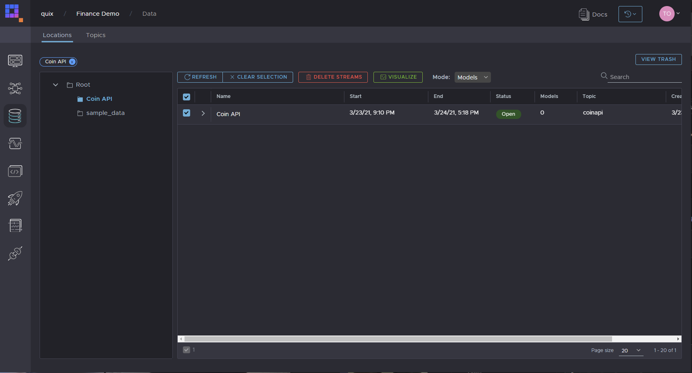
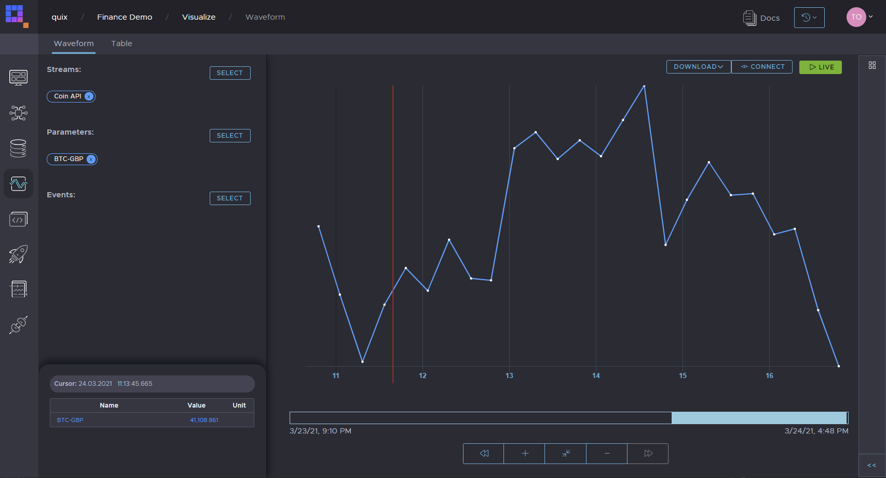

# Coin API bridge
Simple bridge to send exchange rates from Coin API to Quix platform

## Prerequisites
- You must have an account on the Quix platform that you can log into.
- Create a workspace in Quix
- Create a topic in your new workspace

## Get a free Coin API key
Go to [https://www.coinapi.io/](https://www.coinapi.io/) and click on **GET A FREE API KEY**

## Setting up request call to Coin API
```python
from_currency = "BTC"
to_currency = "USD,GBP"

url = 'https://rest.coinapi.io/v1/exchangerate/{0}?filter_asset_id={1}'.format(from_currency, to_currency)
headers = {'X-CoinAPI-Key': '{placeholder:token}'}
```

## Setting up connection to Quix Kafka topic
Use **Library** to generate code snippet to connect to Quix Kafka topic. You should get following code with placehodlers replaced:
```python
# Create a client factory. Factory helps you create StreamingClient (see below) a little bit easier
security = SecurityOptions('{placeholder:broker.security.certificatepath}', "{placeholder:broker.security.username}", "{placeholder:broker.security.password}")
client = StreamingClient('{placeholder:broker.address}', security)

output_topic = client.open_output_topic('{placeholder:topic}')
```

## Setting up Quix SDK stream
We set some metadata to Quix SDK stream like name and location in data catalogue.
```python
stream = output_topic.create_stream("coin-api")

# Give the stream human readable name. This name will appear in data catalogue.
stream.properties.name = "Coin API"

# Save stream in specific folder in data catalogue to help organize your workspace.
stream.properties.location = "/Coin API"
```

## Main request loop
```python
while True:
    try:
        response = requests.get(url, headers=headers)

        data = response.json()

        rows = data['rates']

        for row in rows:
            # For every currency we send value.
            stream.parameters.buffer.add_timestamp(parser.parse(row['time'])) \
                .add_value("{0}-{1}".format(from_currency, row['asset_id_quote']), row['rate']) \
                .write()

            print("{0}-{1}: {2}".format(from_currency, row['asset_id_quote'], row['rate']))

        time.sleep(900)  # We sleep for 15 minute not to reach free account limit.
    except Exception:
        print(traceback.format_exc())
```

# Result
In Quix Data catalogue (as long as you have enabled **persistence** for the topic) you should see new stream called **Coin API**.

[](img/data-catalogue.png "Data catalogue") 
[](img/visualize.png "Visualize") 
